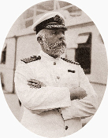

## Learning Objectives

- Introduce you to R and RStudio.
- RStudio
- R Basics
- Import CSV
- Data Management
- Exploratory Data Analysis
- Hypothesis Testing
- Prediction

## Learning Objectives - Disclaimer

- This is NOT a statistics workshop.
- This is a How-To in R workshop.
- They had five days to sink the Titanic.
- We only have 3 hours.

 

##  Workshop Structure

- Captain Smith says YOU need write code.
    - He ~~has a good track record~~ sank his boat.
    - Learning is **DOING** (preferably with joy).
- Each presentation (except this one) is accompanied by a workbook.
    - These files are yours to keep. They will have ALL of the code
      from today's workshop and any code you write.
- All workshop materials available to you to use and modify.
    - If you use these materials elsewhere, I'd appreciate attribution.

## Stupid Questions?

- There are no stupid question!
- We are here to help you!
- Stop us if you feel you are getting lost.
- Always avoid icebergs off the starboard bow.

## What Is R?

According to Wikipedia, R is:

- An  ~~clone~~ implementation  of S.
- A language that uses ~~static~~ lexical  scoping.
- An  ~~kinda pokey~~ interpreted language for statistical analysis.

 

[Wikipedia: R Programming Language](https://en.wikipedia.org/wiki/R_%28programming_language%29)

- SAS was developed at the North Carolina State University
  in 1966. The SAS institute was formed in 1976. In spite of its long
  relationship with health care, it was originally developed to analyze
  agricultural data.
- John Chambers started programming S in 1976 to replace a bunch of
  Fortran routines used at Bell Labs (part of AT&T).
- The aim of the language is: "to turn ideas into software, quickly
  and faithfully".
- R is an open source descendant of S
- The big improvement -  lexical scoping!
- Ross Ihaka and Robert Gentleman started programming R in 1996 - 1996.
- R is referred to as the lingua franca of data analysis.

## Why Learn R? {.smaller}

- Integrated
    - SAS & SPSS
    - PostgreSQL, Oracle, SQL Server, Vertica
- Supported
    - R Foundation
    - Microsoft
- Extensible
    - Over 7,000 packages available no CRAN.
    - CRAN, BioConductor, GitHub
- Resilient
- Ecosystem
- Free and Open Source Software (FOSS).
    - Free as in freedom, not beer.
    - Four Freedoms

- Integrated
- Supported
- Extensible
- Resilient - No Single Point of Failure
- Ecosystem - Not a Tool
- FOSS

## Four Freedoms of Free Software

- **Freedom 0:** The freedom to run the program for any purpose.
- **Freedom 1:** The freedom to study how the program works, and change it to make it do what you wish.
- **Freedom 2:** The freedom to redistribute copies so you can help your neighbor.
- **Freedom 3:** The freedom to improve the program, and release your
  improvements (and modified versions in general) to the public, so
  that the whole community benefits.

## Imagine, Open Research

- Data can't always be public.
- IF DOH intentionally releases PHI, we go to jail.
- But, our methods, our assumptions: These things are not private, but
  they do influence the end result.
- Imagine research where statistical methods and application were all
  100% transparent.

## Acknowledgements

A few organizations who contributed / influenced these slides.

- DOH EBCoP
- SUNY Rockefeller
- Kaggle's "Titanic: Machine Learning From Disaster" Project
- Data Carpentry's R Ecology Demo
- Rush (Canadian Rock Band)

- I based this workshop on a Kaggle data set used to introduce new
  members to machine learning.
- I also owe a big thanks to the folks at Data Carpentry who I stole
  liberally from: R Ecology workshop.

## NEXT

- Let's Do Some R!
    - *AND* Sink A *(Titanic)* Boat!
- Start RStudio
    - Is anyone not using RStudio today?
- Open the file workbook-01-intro-to-r.Rmd.
