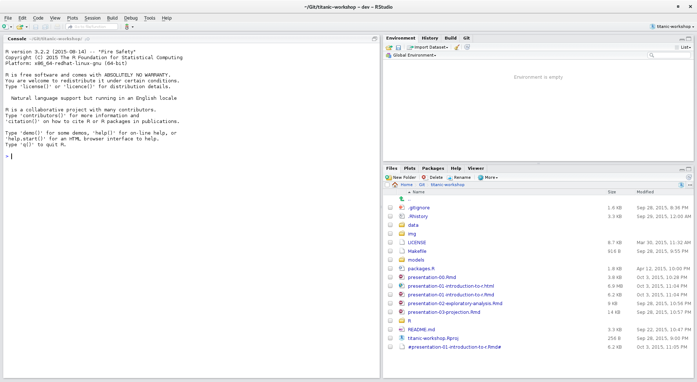
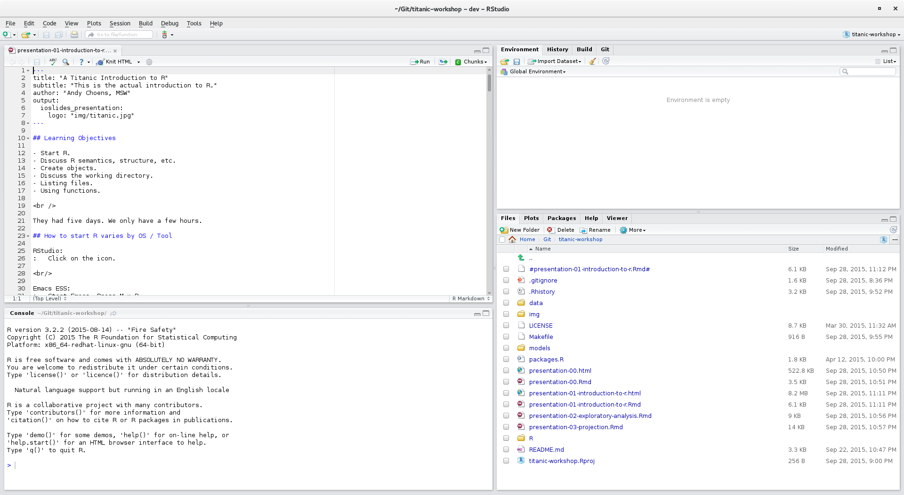
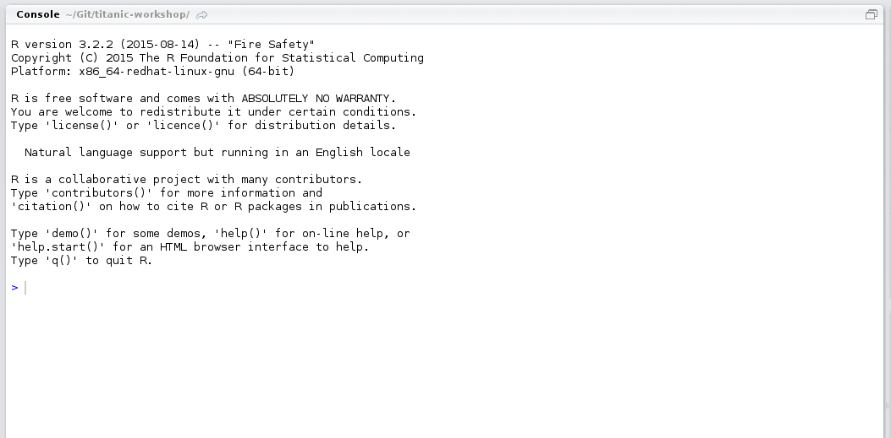
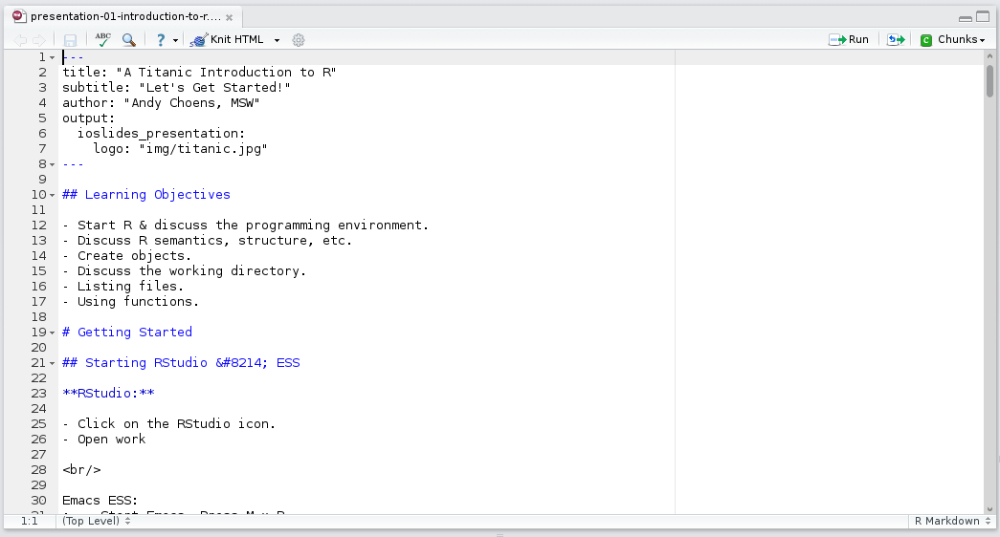
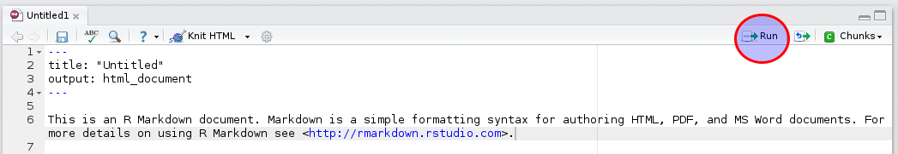

## Workbook

- You can run the code in these slides by opening
  `01-introduction-to-r.R` and following along.
- **ALL** of the code you see on the screen today is in your
  workbook.
- You will learn more if you see the code run for yourself.
    - *This is technically an untested hypothesis. Sorry.*

## Learning Objectives

- RStudio
- R Semantics, Structure, Etc.
- Getting Help
- Atomic Data Types
- Vectors

```{r 01-INTRODUCTION-TO-R, echo=FALSE,eval=TRUE,purl=TRUE}

## Learning Objectives -----------------
## - RStudio
## - R semantics, structure, etc.
## - Getting Help
## - Atomic Data Types
## - Vectors

## Slides URL: https://choens.github.io/titanic-workshop/01-introduction-to-r.html

```

# First Steps In R


## To Start RStudio

- Click on the RStudio icon.
- Open the R Script you would like to run: `01-introduction-to-r.R`
- ~~Sink a very large boat.~~ *(Not technically necessary.)*

<br/>

#### Questions

- Is anyone NOT using RStudio today?
- Does anyone need help getting RStudio / R to start?

```{r STARTING-RSTUDIO, echo=FALSE,eval=TRUE,results='hide',purl=TRUE}

## To start RStudio:
## - Click on the RStudio icon.
## - Open the R Script you would like to run.
## - Sink a very large boat.

```

## RStudio: Screenshot 1 {.centered}

[](img/rstudio-01.png)

## RStudio: Screenshot 2 {.centered}

[](img/rstudio-02.png)

## Two ways to run code:

<div style="float:left;width:50%">
#### REPL
<br />
<br />

</div>

<div style="float:right;width:50%">
#### R Scripts
<br />
<br />

<br />
<br />

</div>

```{r TWO-WAYS-TO-RUN-CODE, eval=TRUE,echo=FALSE,purl=TRUE}

## You can run code in one of three ways:
## 1. REPL: The interactive console in the bottom left of RStudio.
## 2. R Scripts: Write a script and run it via the run command.
##    - To run the code, put your cursor on the row you want to run and hit
##      [CTRL]+[ENTER] OR hit the "Run" button in the top right hand corner.

```

## An Overly Complicated Calculator

- R is a great calculator.
- PLEASE tell us know if you can't find this code in
  the <br/> `01-introduction-to-r.R` workbook.
- Now that you have found it - **You try it!**

```{r AN-OVERLY-COMPLICATED-CALCULATOR, eval=TRUE,echo=TRUE,purl=TRUE,results="hide"}

## You can use R as an over-powered calculator.
## Type the following into the REPL console or run them from the
## 01-introduction-to-r.R script.

1 + 1

sqrt(9)             ## sqrt() is a function.

sqrt(1+5+6-3)       ## We can pass values to functions and get results.

```

## Practice: Calculator

This is our first visit from Captain Smith.

```{r PRACTICE-CALCULATOR, eval=TRUE,echo=TRUE,purl=TRUE,results="hide"}

## What is the value of (1+2)*(1+1+1) ?

## Write the "equation" here and run it.

```

Answer:

>- [1] 9

## Assignment Operators {.smaller}

**NOTE:** You should run this code with me.

```{r ASSIGNMENT-OPERATORS-EQUALS, eval=TRUE,echo=TRUE,purl=TRUE,results='hide'}

## The equals sign can be used to assign value to a variable.
a = 1
a

```

Returns:

>- [1] 1

```{r ASSIGNMENT-OPERATORS-AO, eval=TRUE,echo=TRUE,purl=TRUE,results='hide'}

## But the preferred assignment operator is "<-".
## RStudio Shortcut: [Alt] [-] will insert the R assignment operator.

a <- 1
a

```

Returns:

>- [1] 1

##  Practice: Assignment Operator

```{r PRACTICE-ASSIGNMENT-OPERATOR, echo=TRUE,eval=TRUE,purl=TRUE}

## Create a variable "sank" and give it a value of "1912".

## Replace this comment with some code.
```

<br />
<br />

Correct Answers: *(No Peeking!)*

>- `sank <- 1912`
>- `sank <- "1912"`

# Atomic Data Types


## Atomic Data Types - Numeric

- R has extensive support for different types of numbers.
- R can also handle imaginary numbers and other fun mathematical
  oddities.
- Today, we are going to keep it "real".

```{r ATOMIC-DATA-TYPES-NUMERIC, echo=TRUE,eval=FALSE,purl=TRUE}

## Numeric -----------------------------
pi <- 3.14159

## We can confirm this:
typeof(pi)          ## This is a function we will use again.

```

<br />

Returns:

>- `[1] "double"`

## Atomic Data Types - Funny Integers

- **Question:** Are you running this code as I do?
- **Best Answer:** Yes!

```{r ATOMIC-DATA-TYPES-INTEGERS-FUNNY, echo=TRUE,eval=FALSE,purl=TRUE}

## Integers are funny. They have to be created consciously.
## FUN FACT: The fourth smoke stack seen in picures is for aesthetic purposes.
## TODO - Check this "fun fact".
real_smoke_stacks <- 3
typeof(real_smoke_stacks)  ## Do you remember this function?

```

<br />

Returns:

>- `[1] "double"`
>- Yes, 3 **IS** an integer but R is treating like a flot / double / decimal.

## Atomic Data Types - Integers {.smaller}

```{r ATOMIC-DATA-TYPES-INTEGERS, echo=TRUE,eval=FALSE,purl=TRUE}

## Integers must be created consciously.
real_smoke_stacks <- as.integer(3)
typeof(real_smoke_stacks)

```

Returns:

>- `[1] "integer"`

```{r ATOMIC-DATA-TYPES-IS-INTEGER, echo=TRUE,eval=FALSE,purl=TRUE}

## We can (double) confirm this:
is.integer(real_smoke_stacks)

```

Returns:

>- `[1] TRUE`

- **Question:** Why would R have this behavior?

>- **Answer:** R tries to give your variables the "right" type.

## Numerics ARE Safer {.smaller}

```{r NUMERICS-ARE-SAFER-1, echo=TRUE,eval=FALSE,purl=TRUE,results="hide"}

## Question: What is the assigned value of port?
real_smoke_stacks <- as.integer(3)
real_smoke_stacks

```

Answer:

>- `[1] 3`

```{r NUMERICS-ARE-SAFER-2, echo=TRUE,eval=FALSE,purl=TRUE,results="hide"}

## Question: What is the assigned value of port?
real_smoke_stacks <- as.integer(3.14159)
real_smoke_stacks

```

Answer:

>- `[1] 3`
>- The decimal, 3.14159, was coerced to an integer.
>- R floors decimal values. It does NOT round them.

## Numerics ARE Safer {.smaller}

```{r NUMERICS-ARE-SAFER-3, echo=TRUE,eval=FALSE,purl=TRUE,results="hide"}

## Question: What is the assigned value of my_var?
my_var <- 3.3 * 4
my_var

```

Answer:

>- [1] 13.2

```{r NUMERICS-ARE-SAFER-4, echo=TRUE,eval=FALSE,purl=TRUE,results="hide"}

## Question: What is the assigned value of port?
my_var <- as.integer(3.3) * 3
my_var

```

Answer:

>- [1] 9

## Numerics ARE Safer: Discussion

- Avoid integers unless you KNOW it is an integer.
- Many programming languages will make integers into integers and then
  do integer math, even when you don't want it to.
- R hates you less.
- Don't look like this guy. Use Numerics.


## Atomic Data Types - LOGICAL {.smaller}

```{r ATOMIC-DATA-TYPES-LOGICAL-LTE, echo=TRUE,eval=TRUE,purl=TRUE,results="hide"}

## LOGICAL variables are often created in the process of comparing things.
real_smoke_stacks <- 3; apparent_smoke_stacks <- 4;

## Question: Is this TRUE or FALSE?
real_smoke_stacks <= apparent_smoke_stacks  ## Yes, this is a trivial example.

```

Answer:

>- `[1] TRUE`

```{r ATOMIC-DATA-TYPES-LOGICAL-E, echo=TRUE,eval=TRUE,purl=TRUE,results="hide"}

## Question: Is this TRUE or FALSE?
real_smoke_stacks = apparent_smoke_stacks

```

Answer:

>- NEITHER!!!
>- This is the equivalent of: `real_smoke_stacks <- 4`!
>- To compare equality, we need a different syntax. . . .

## Atomic Data Types - LOGICAL

```{r ATOMIC-DATA-TYPES-LOGICAL-EE, echo=TRUE,eval=TRUE,purl=TRUE,results="hide"}

## LOGICAL variables are often created in the process of comparing things.
real_smoke_stacks <- 3; apparent_smoke_stacks <- 4;

## THIS IS HOW YOU COMPARE THINGS!
real_smoke_stacks == apparent_smoke_stacks

```

Returns:

>- `[1] FALSE`
>- Comparison operators: `<`, `>`, `==`, `<=`, `>=`, `|`, `!`

## Atomic Data Types - CHARACTER {.smaller}

- Andy likes to call "character" variables "string" vars.
- He profusely apologizes in advance, but he has a point, this is like
  a SQL string.

```{r ATOMIC-DATA-TYPES-CHARACTER, echo=TRUE,eval=TRUE,purl=TRUE,results="hide"}

## You can use " or ' to create a character.
## There are subtle differences, mostly if your variable has
## either in it.

## Some character vars:
first_name <- "Captain"
last_name <- "Smith"

## Let's put them together!
paste(first_name, last_name, sep=" ")

```

Returns:

>- `[1] "Captain Smith"`
>- We will learn additional functions as we go.

## Atomic Data Types - DATES {.smaller}

```{r ATOMIC-DATA-TYPES-DATE-1, echo=TRUE,eval=TRUE,purl=TRUE,results="hide"}

## POSIX Dates are EASY!
## Like an integer, you have to be explicit.
## TODO: Get the date of the first day of the voyage.
first_day <- as.Date("2015-01-01")

## typeof
typeof(first_day)         ## typeof may return something you don't expect.

```

Returns:

>- `[1] "double"`
>- Stored internally as a number.

```{r ATOMIC-DATA-TYPES-DATE-2, echo=TRUE,eval=TRUE,purl=TRUE,results="hide"}

## Kinda looks like a character var.
aft

```

Returns:
## TODO: CHANGE THIS
>- `[1] "2015-01-01"`
>- But it LOOKS like a date when we look at it.

## Practice: Atomic Data Types {.smaller}

```{r PRACTICE-ATOMIC-DATA-TYPES, echo=TRUE,eval=TRUE,purl=TRUE,results="hide"}

## 1: Create an variable called "my_age" and then
##    assign it an integer equal to your age.

## 2: Using the following code, which is bigger (later)? a_day or today?

## This creates two date vars.
## Get these dates.
first_day <- as.Date('2015-06-30')
last_day <- 

## Use this space to compare first_day to last_day.
##
## TODO: Fix the answers below.
    
```

Example Answers:

>- `my_age <- 36`
>- `a_day < today` which returns: `[1] TRUE`
>- There are, obviously, other possible answers.

# Vectors


## Vectors

- Vectors are a 1-dimensional data set in R.
- They have two important attributes:
    - Data Type (can be ANY)
    - Length

```{r VECTORS, echo=TRUE,eval=TRUE,purl=TRUE,results="hide"}

## These are real passenger ages!
passenger_age <- c(19,50,22,17,54,23,NA,39,42,58)
passenger_age

```

Returns:

>- [1] 19 50 22 17 54 23 NA 39 42 58
>- The "atomic" variables we created earlier? Just vectors with length 1.
>- You could argue that the width is "1" and while true, this fact is ignored.
>- You have to watch out for NA.

## Vectors - Length

```{r VECTORS-LENGTH-1, echo=TRUE,eval=TRUE,purl=TRUE,results="hide"}

## The variable yard_arm has five distinct values in it.
length(passenger_age)

```

Returns:

>- `[1] 5`

```{r VECTORS-LENGTH-2, echo=TRUE,eval=TRUE,purl=TRUE,results="hide"}

## This variable only has one value.
starboard <- 1
length(starboard)

```

Returns:

>- `[1] 1`

## Vectors - Descriptive Statistics

```{r VECTORS-LENGTH-1, echo=TRUE,eval=TRUE,purl=TRUE,results="hide"}


```


## Vectors - Indexing {.smaller}

- Sometimes, we only want to work with part of a vector.

```{r VECTORS-INDEXING-1, echo=TRUE,eval=TRUE,purl=TRUE,results="hide"}

## Returns the THIRD value stored in yard_arm.
passenger_age[3]    ## The square brackets are important.
                    ## They let us reference and filter
                    ## values in the object.

```

Returns:

>- `[1] 22`


```{r VECTORS-INDEXING-2, echo=TRUE,eval=TRUE,purl=TRUE,results="hide"}

## Returns ALL values in passenger_age with a value greater than 2.
passenger_age[ passenger_age > 40 ]        ## Easy way to filter data.

```

Returns:

>- `[1] 50 54 NA 42 58`
>- Why is NA there?

## Arithmetic on Vectors {.smaller}

- Arithmetic is done on all members of the vector.

```{r ARITHMETIC-ON-VECTORS-1, echo=TRUE,eval=TRUE,purl=TRUE,results="hide"}

## We can do math on vectors.
var_a <- c(25,30,40,45,50)
var_b <- c(90,70,50,30,10)

var_a + var_b

```

Returns:

>- `[1] 115 100  90  75  60`
>- Notice how R did the addition OVER the vector.
>- Vectors have meaning!
>- R applies MANY functions OVER the vector.
>- We call this vectorization! This is an important skill.

```{r ARITHMETIC-ON-VECTORS-2, echo=TRUE,eval=TRUE,purl=TRUE,results="hide"}

## We can do math on vectors.
var_a <- c(25,30,40,45,50)
var_b <- 3

var_a * var_b

```

Returns:

>- `[1]  75  90 120 135 150`

## Operating on Vectors {.smaller}

```{r OPERATING-ON-VECTORS-1, echo=TRUE,eval=TRUE,purl=TRUE,results="hide"}

## Other functions will aggregate. WHY?

## Average of passenger_age.
mean(passenger_age, na.rm=TRUE)  ## Why do we need na.rm=TRUE?


```

Returns:

>- `[1] 36`

```{r OPERATING-ON-VECTORS-2, echo=TRUE,eval=TRUE,purl=TRUE,results="hide"}

## Standard Deviation of passenger_age
sd(passenger_age, na.rm=TRUE)  ## Why do we need na.rm=TRUE?

```

Returns:

>- `[1] 16.06238`

## Operating on Vectors {.smaller}

- But not all.

```{r OPERATING-ON-VECTORS-3, echo=TRUE,eval=TRUE,purl=TRUE,results="hide"}

## We can do math on vectors.
var_c <- c(25.1,389.776,43.6,41.3,57.56)

round(var_c,1)

```

Returns:

>- `[1]  25.1 389.8  43.6  41.3  57.6`

Discussion:

- When using functions on vectors you MUST know what it is doing.
- Or you may get unexpected results.

## Practice: Vectors {.smaller}

- Last practice before we break.

```{r PRACTICE-VECTORS, echo=TRUE,eval=TRUE,purl=TRUE,results="hide"}

## 1: Create an vector, with a length of 4. Put the years
##    you went to highschool into this vector.
##    "Numeric" integers are fine for this. You don't need dates.
##    If you need help, try this:
##    ?c

## 2: Use an index and a greater than or less than boolean operator
##    to return the last three years you went to highschool.

## 3: Run typeof on your new highschool years variable.
##    What is the output.
##    Does it surprise you?

## 4: What was the "average" year you went to highschool?
##    Yes. This is a completely meaningless number. Sorry.

```

- Example Answers on next slide.

## Example Answers:

- `hs_years <- c(1994,1995,1996,1997)`
- `hs_years[ hs_years>1994 ]` which returns: `[1] TRUE`
- `typeof(hs_years)`
- `mean(hs_years)`

## Quick Recap

- RStudio
- R Semantics, Structure, Etc.
- Getting Help
- Atomic Data Types
- Vectors

# Questions?


