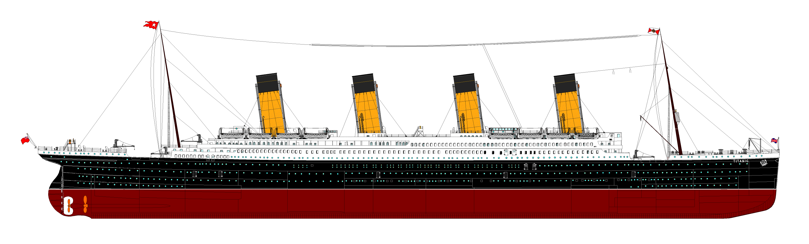

## Learning Objectives

- Histogram
- Box Plot
- Scatter Plot

<br />

### Note:

Principal Components Analysis and other more advanced EDA tools are
not part of today's workshop.

*I am, however, interested in developing more modules for this
 workshop, so if you'd like to volunteer to help, talk to me.*

## Defining Exploratory Data Analysis

Today, we will define Exploratory Data Analysis as:

- an approach to analyzing data sets to summarize their main
  characterisitcs, often with visual methods.
- R was actually designed with EDA in mind.
- Today, we will be using BASE R for our graphics. These are
  relatively easy to use, but are not necessarily beautiful.
    - The `ggplot2` and `ggvis` packages are more appropriate for
      producing publication ready graphics.

## Data Import

- One must first have some data.

```{r DATA-IMPORT, echo=TRUE,eval=TRUE,purl=TRUE}

## Imports the Titanic Training Data and makes the col names lower case.
ti_train <- read.csv("data/train.csv", as.is=TRUE)
names(ti_train) <- tolower( names(ti_train) )

## Displays the number of rows / columns in the data frame.
dim(ti_train)

```

### Note:

- If you do not have the ti_train object in your current R session,
please tell someone now.

## What Did We Import? {.smaller}

```{r WHAT-DID-WE-IMPORT, echo=TRUE,eval=TRUE,purl=TRUE}

# Fast, compact way of reviewing what data was imported.
str(ti_train)

```

- Additional documentation is available in `data/README.md`
    - Open this file with RStudio!

<div class="notes">

- Compactly display the internal *str*ucture of an R object, a
  diagnostic function and an alternative to ‘summary’ (and to some
  extent, ‘dput’).

</div>

## Selecting Data - Indexes {.smaller}

- To do this, we need to discuss (and practice) how to select data a
  little more.
- There is more than one way to sink a boat.
- Choose the approach that seems to work best in the circumstance.

<br/>

<div style="display:inline-block; margin:1 auto;float:left;width:48%;text-align:left;">

You can select a column by name:

```{r SELECTING-DATA-INDEXES-NAME, echo=TRUE,eval=TRUE,purl=TRUE}

## Selects first 6 entries in
## the name column.
head( ti_train$name )

```

</div>

<div style="display:inline-block; margin:1 auto;float:right;width:48%;text-align:left;">

Or you can select it by index:

```{r SELECTING-DATA-INDEXES-INDEXING, echo=TRUE,eval=TRUE,purl=TRUE}

## Selects first 6 entries in
## the name column.
head( ti_train[,"name"] )

```

</div>

<div class="notes">

R is like Perl, many different ways to do everything.

Use the method:

- you are comfortable with,
- you want to type,
- is appropriate at that moment.
  
</div>

## Selecting Data - Numeric Index

- `ti_train[,"name"]` is very similar to how we index vectors.
- In 2-D data, R always: `[ROWS, COLS]`
- There are **NO** exceptions.

```{r SELECTING-DATA-NUMERIC-INDEX, echo=TRUE,eval=TRUE,purl=TRUE}

## We can select the first six entries in the names columns numerically too.
head( ti_train[,4] )

```

## Select a Row

- We won't need to do this today, but this is an example of how to
  select a single row.
- But, we will use a VERY similar technique to filter data.
- Note the use of "==" and the location of the "," in between [ and ].

```{r SELECT-A-ROW, echo=TRUE,eval=TRUE,purl=TRUE,results='hide'}

## Returns all rows where "name" is exactly "Montvila, Rev. Juozas".
## There is only one such row.
ti_train[ti_train$name == "Montvila, Rev. Juozas", ]

```

##   Demo: Indexing and Filtering Data

- We can use a slight twist of what we saw in the last slide to select
  all rows which meet a specific criteria.
- NAs are tricky in R.

```{r DEMO-FILTER-DATA, echo=TRUE,eval=TRUE,purl=TRUE,results='hide'}

## This returns all rows of ti_train where age is over 75.
## But why does it look so strange?
## You should run this code to confirm that is returns many NULL rows.
ti_train[ti_train$age > 75, ]

```

<div class="notes">

- ALWAYS find the NAs early and deal with them.
- Or they will bite you.

</div>

##  Demo: Filter Data: NA

```{r FILTER-DATA-NA, echo=TRUE,eval=TRUE,purl=TRUE,results='hide'}

## This gives us ONLY those who are over 75 because it 
##  removes all rows where age is NA (like NULL).
ti_train[ti_train$age > 75 & !is.na(ti_train$age), ]

```

- The "&" lets us have more than one filter on the data.
- The "!" inverts the Boolean.
- The filter is BEFORE the comma, which means this filter removes rows.

## How Many NAs?

```{r filter-na-length, echo=TRUE, eval=TRUE, results="asis"}

length( ti_train$age[ is.na(ti_train$age) ] )

```

## Filter Data: Hadley-Style (dplyr)

- The way R handles NAs is . . . . annoying.
- Fortunately, we have Hadley Wickham on our side.
- His way is (almost always) the easier way.

```{r filter-dplyr-show, echo=TRUE, eval=FALSE, results="asis"}

library(dplyr)
filter(ti_train, age > 75)

```

```{r filter-dplyr-actual, echo=FALSE, eval=TRUE, warning=FALSE, message=FALSE, results="raw"}

##suppressMessages( library(dplyr) )
library(dplyr)
filter(ti_train, age > 75)[,1:5]

```

# What Proportion of People Died?



<div class="notes">

- Everyone knows a lot of people died when the Titanic sank.
- There were ~ 1,317 people aboard her maiden voyage.

- What proportion of passengers died? Any guesses?

- Titanic had room for a maximum of 2,566 passengers.
- She was only about half full.
- It, actually, could have been much worse.

</div>

## Story Telling

- The goal of analysis is to tell a story.
- The trick is telling the right one.
- If you aren't careful, you tell the wrong story.
- Watch out for "funky" data.

## Survived

- Survived is numerical, but categorical.
- 1 x 2 Cross Tab

```{r survival-n-show, echo=TRUE, eval=TRUE, results="raw"}

## Remember: 1 == Yes, 0 == No
tbl <- table(ti_train$survived)
tbl

```
<div class="notes">

- Preferably the true story.
- A story that leads to understanding.

</div>

## Survived Proportions

- Use the tbl object created previously.

```{r survival-prop-show, echo=TRUE, eval=TRUE, results="raw"}

prop.table( tbl )

```

<br/>
- Nearly 62% Of Passengers Died!

# Hypothesis: Sex and Survival?


<div class="notes">

- Do you hypothesize there is a relationship between someone's gender
  and their chances of surviving the Titanic?

</div>

## Sex

- Before we look for a relationship, we should look at sex alone.

```{r one-factor-table, echo=TRUE, results="raw"}

## One Factor Table.
table(ti_train$sex)

```

<br/>
*

> - There were more men than women.

## Survival by Sex - Cross Tab

```{r two-factor-table-1, echo=TRUE, results="raw"}

## Creates a 2x2 Cross Tab
tbl <- table(ti_train$survived, ti_train$sex)
tbl

```

<br/>
*

> - Even though there are more total men, more total women survived.

## Survival by Sex - Proportions {.smaller}

```{r two-factor-table-perc, echo=TRUE, results="raw"}

## Uses the tbl object we created previously.
prop.table(tbl, margin=2)

```

**Margin == 1**

- Proportions will total to 100% across each row.

**Margin == 2**

- Proportions will total to 100% across each column.

## Survival by Sex - Statistical Significance

- Are the observed differences statistically significant?
- Will not get into the p-value debate.

```{r two-factor-table-summary, echo=TRUE, results="raw"}

## For our porpoises, p < .05 is significant.
summary(tbl)

```

<br/>
*

> - Yes. The observed differences are statistically significant.

## Survival by Sex - Visualization {.smaller}

- So, what is our story here?

```{r plot-sex, echo=TRUE, fig.align="center", fig.height = 3, fig.width=3}

## Using ggvis, not base R.
##library(ggvis)  

##ti_train %>% ggvis( ~sex, fill=~as.character(survived) ) %>% layer_bars()
    
```

# Hypothesis: Age and Survival?


<div class="notes">

- Sex correlates with the odds ratio of survival.
- What about age? Does it correlate with survival?
- Correlation does not imply causation, although in this example it
  generally does.
  
</div>
  
## Age - Histogram

- Age is a continuous variable.
- Bins (groups) age by 10 year age blocks.

```{r age-hist-all, echo=TRUE, fig.height=2, fig.width=3, fig.align="center"}

#### Plots a histogram of age. (You must remove NAs.)
##ti_train %>% filter(!is.na(age)) %>%
##        ggvis(~age) %>% layer_histograms( width=10)

```

## Survival x Age - Histograms {.smaller}

- What is our story here?

<div style="display:inline-block; margin:auto; float:left; width:48%;">

### Survivors

```{r age-hist-survivors, echo=TRUE, fig.height = 2, fig.width=3, fig.align="center" }

#### Survivors Only
##ti_train %>%
##    filter(!is.na(age), survived == 1) %>%
##        ggvis(~age) %>%
##                layer_histograms( width=10)

```
</div>

<div style="display:inline-block; margin:auto; float:right; width:48%;">

### Deceased

```{r age-hist-not-survivors, echo=TRUE, fig.height = 2, fig.width=3, fig.align="center"}

#### Deceased Only
##ti_train %>%
##    filter(!is.na(age), survived == 0) %>%
##        ggvis(~age) %>%
##                layer_histograms( width=10)

```
</div>

## Regression - Survival x Age Continued  {.smaller}
 
- Loess Curve
- Does this change our story any?

```{r age-loess, echo=TRUE, fig.height=2.75, fig.width=5}

## ## SE is shown as a loess curve.
## ti_train %>%
##     filter( !is.na(age) ) %>%
##         ggvis(~age, ~survived) %>%
##             layer_smooths()

```

## Regression - Survival x Age Continued  {.smaller}

- Density Plot x Survival

```{r age-densities, echo=TRUE, fig.height=2.5, width=3}

##ti_train %>%
##    filter( !is.na(age) ) %>%
##        mutate(
##            Survived = as.factor( ifelse(survived == 1, "Yes", "No"))
##           ,Age = age ) %>%
##               ggvis( ~Age) %>%
##                   group_by(Survived) %>%
##                       layer_densities( fill=~Survived )


```

# Your Turn.


