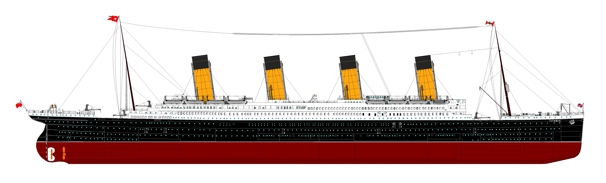

## Goals

- Exploratory Data Analysis (EDA)
- Hypothesis Testing
- Tell A Story (Or Two)

To operationalize this, we will learn how to:

- Ask Questions.
- Build Cross Tabs.
- Test for statistical significance using Chi-Square.
- Use Regression.
- Visualize Our Data using ggvis (not base R).

## What Is Exploratory Data Analysis?

- When you see the big damned boat, get ready to make a hypothesis!

- Today, we will define EDA as a collection of visualization and
  hypothesis testing techniques to help us understand the shape and
  meaning of our data.
- This is not a Tukey compliant definition of EDA, but it will have to
  do for the time being.

## Data Import

- One must have data to EDA. *(Yes, I just verbbed that.)*
- Abstract data import / export functions.

```{r import-show, echo=TRUE, results="raw"}

## "Reads" the file, importing the function into our current global environment.
## Remember. R is lexically scoped.
source("R/read.train.R")

## Imports the data into a data frame called train.
## These functions are a good place to put data munging tasks.
train <- read.train()

## Displays the number of rows / columns in the data frame.
dim(train)

```

- Abstracting data import and export simplifies your analysis code
  because import and export are often quite complicated.
- Although did not do this today, I often include any / all data clean
  up, restructuring, etc. in my import functions.

## What Did We Import?

```{r str-train-show, echo=TRUE, eval=TRUE, results="raw"}

str(train)

```

- str: Compactly display the internal *str*ucture of an R object, a
  diagnostic function and an alternative to ‘summary’ (and to some
  extent, ‘dput’).

## Selecting Data - Indexes

- There is more than one way to skin a cat.
- Choose the approach that seems to work best in the circumstance.

```{r selecting-column-l-show, echo=TRUE, eval=TRUE}

## Select a column
train$name

```

```{r selecting-column-r-show, echo=TRUE, eval=TRUE}

## Select a column, with indexing.
train[,"name"]

```

R is like Perl, many different ways to do everything.

Use the method:

- you are comfortable with,
- you want to type,
- is appropriate at that moment.
  
## Select a Row

```{r select-a-row-show, echo=TRUE, eval=TRUE, results="raw"}

train[train$name == "Montvila, Rev. Juozas", ]

```

## Filter Data

- NAs are tricky in R.

```{r filter-only-age-show, echo=TRUE, eval=TRUE}

train[train$age > 75, ]

```

- Find the NAs early and deal with them.
- Or they will bite you.

## Filter Data: Continued

```{r filter-na-show, echo=TRUE, eval=TRUE, results="asis"}

train[train$age > 75 & !is.na(train$age), ]

```

## How Many NAs?

```{r filter-na-length, echo=TRUE, eval=TRUE, results="asis"}

length( train$age[ is.na(train$age) ] )

```

## Filter Data: Hadley-Style (dplyr)

- The way R handles NAs is . . . . annoying.
- Fortunately, we have Hadley Wickham on our side.
- His way is (almost always) the easier way.

```{r filter-dplyr-show, echo=TRUE, eval=TRUE, results="asis"}

library(dplyr)
filter(train, age > 75)

```

# What Proportion of People Died?

- Everyone knows a lot of people died when the Titanic sank.
- There were ~ 1,317 people aboard her maiden voyage.

- What proportion of passengers died? Any guesses?

- Titanic had room for a maximum of 2,566 passengers.
- She was only about half full.
- It, actually, could have been much worse.

## Story Telling

- The goal of analysis is to tell a story.
- The trick is telling the right one.
- If you aren't careful, you tell the wrong story.
- Watch out for "funky" data.

## Survived

- Survived is numerical, but categorical.
- 1 x 2 Cross Tab

```{r survival-n-show, echo=TRUE, eval=TRUE, results="raw"}

## Remember: 1 == Yes, 0 == No
tbl <- table(train$survived)
tbl

```
- Preferably the true story.
- A story that leads to understanding.

## Survived Proportions

- Use the tbl object created previously.

```{r survival-prop-show, echo=TRUE, eval=TRUE, results="raw"}

prop.table( tbl )

```

- Nearly 62% Of Passengers Died!

# Hypothesis: Sex and Survival?

- Do you hypothesize there is a relationship between someone's gender
  and their chances of surviving the Titanic?

## Sex

- Before we look for a relationship, we should look at sex alone.

```{r one-factor-table, echo=TRUE, results="raw"}

## One Factor Table.
table(train$sex)

```
- There were more men than women.

## Survival by Sex - Cross Tab

```{r two-factor-table-1, echo=TRUE, results="raw"}

## Creates a 2x2 Cross Tab
tbl <- table(train$survived, train$sex)
tbl

```

- Even though there are more total men, more total women survived.

## Survival by Sex - Proportions {.smaller}

```{r two-factor-table-perc, echo=TRUE, results="raw"}

## Uses the tbl object we created previously.
prop.table(tbl, margin=2)

```

**Margin == 1**

- Proportions will total to 100% across each row.

**Margin == 2**

- Proportions will total to 100% across each column.

## Survival by Sex - Statistical Significance

- Are the observed differences statistically significant?
- Will not get into the p-value debate.

```{r two-factor-table-summary, echo=TRUE, results="raw"}

## For our porpoises, p < .05 is significant.
summary(tbl)

```

- Yes. The observed differences are statistically significant.

## Survival by Sex - Visualization {.smaller}

- So, what is our story here?

```{r plot-sex, echo=TRUE, fig.align="center", fig.height = 3, fig.width=3}

## Using ggvis, not base R.
library(ggvis)  

train %>% ggvis( ~sex, fill=~as.character(survived) ) %>% layer_bars()
    
```

# Hypothesis: Age and Survival?

- Sex correlates with the odds ratio of survival.
- What about age? Does it correlate with survival?
- Correlation does not imply causation, although in this example it
  generally does.

## Age - Histogram

- Age is a continuous variable.
- Bins (groups) age by 10 year age blocks.

```{r age-hist-all, echo=TRUE, fig.height=2, fig.width=3, fig.align="center"}

## Plots a histogram of age. (You must remove NAs.)
train %>% filter(!is.na(age)) %>%
        ggvis(~age) %>% layer_histograms( width=10)

```

## Survival x Age - Histograms {.smaller}

- What is our story here?

### Survivors

```{r age-hist-survivors, echo=TRUE, fig.height = 2, fig.width=3, fig.align="center" }

## Survivors Only
train %>%
    filter(!is.na(age), survived == 1) %>%
        ggvis(~age) %>%
                layer_histograms( width=10)

```

### Deceased

```{r age-hist-not-survivors, echo=TRUE, fig.height = 2, fig.width=3, fig.align="center"}

## Deceased Only
train %>%
    filter(!is.na(age), survived == 0) %>%
        ggvis(~age) %>%
                layer_histograms( width=10)

```

## Regression - Survival x Age Continued  {.smaller}
 
- Loess Curve
- Does this change our story any?

```{r age-loess, echo=TRUE, fig.height=2.75, fig.width=5}

## SE is shown as a loess curve.
train %>%
    filter( !is.na(age) ) %>%
        ggvis(~age, ~survived) %>%
            layer_smooths()

```

## Regression - Survival x Age Continued  {.smaller}

- Density Plot x Survival

```{r age-densities, echo=TRUE, fig.height=2.5, width=3}

train %>%
    filter( !is.na(age) ) %>%
        mutate(
            Survived = as.factor( ifelse(survived == 1, "Yes", "No"))
           ,Age = age ) %>%
               ggvis( ~Age) %>%
                   group_by(Survived) %>%
                       layer_densities( fill=~Survived )


```

# Your Turn.




