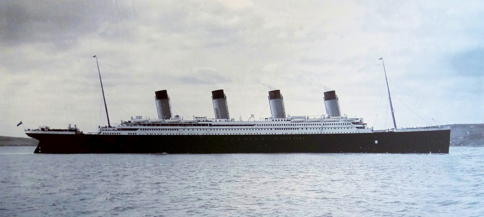

# Instructions

- Welcome!
- Please find a computer and log in using the guest account on that
  system.
  - Logging in with a guest account may be a little slow. Go ahead and
    make sure you can log in.
- Please go to: `https://choens.github.io/titanic-workshop/` and
  download zip file listed under `Participant Resources` below.
- Think watery thoughts.

# Presentations

- <a href="https://choens.github.io/titanic-workshop/00-about.html" target="_blank">00: About</a>
- <a href="https://choens.github.io/titanic-workshop/01-introduction-to-r.html" target="_blank">01: Introduction To R</a>
- <a href="https://choens.github.io/titanic-workshop/02-data-frames.html" target="_blank">02: Data Frames</a>
- 03:
- 04:

# Participant Resources

- TODO - Link to participant materials.
- TODO - Link to Google Form for Feedback

# Other Helpful Resources

- StackOverflow
- Quick-R
